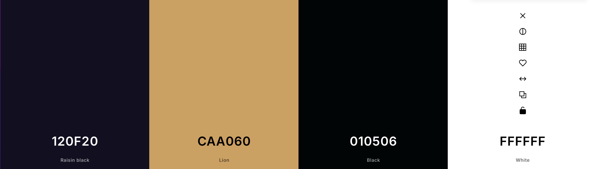

    
  
  # **Urbex**

  #### Urbex is a website used to find and explore abandoned places near you! With filtering and other options available. The users are able to make their own posts.

  

  COLOR PALETTE            |  DEMO
:-------------------------:|:-------------------------:
   |  <video width=100% controls><source src="demo.mp4" type="video/mp4">DEMO Video</video>

## **KEY FEATURES:**
The user will be able to make their own posts, as well as looking through all posts that have been made already. Hopefully it will help someone find an abandoned place near them so that they can explore it.
## **HOW TO USE (Visual Studio Code)**

1. You will need to launch Urbex through your browser.

2. You will be directed to the home page which displays all of the current posts.

3. You can either make a post and it will be displayed on the home page or you can navigate to the about page to see the documentation.